# Backend Architecture & Implementation Guide — Legal Knowledge Graph RAG

This document is a comprehensive, deep-dive guide to the backend system of the **Legal Knowledge Graph RAG (GraphRAG) MVP**. It covers the architecture, detailed file roles, the step-by-step mechanics of how ingestion and query-retrieval operate, system schemas, tradeoffs, and design choices.

---

## 1. System Overview & Core Goal

The backend is built as a high-performance **FastAPI** service designed to resolve complex, relational legal questions (focusing initially on the **GDPR** for MVP, with stubs for the **DPDP Act** and the **AI Act**). 

### Why Plain RAG is Insufficient for Law
Standard RAG pipelines chunk a document, embed it, search vector spaces, and prompt an LLM with the raw text segments. This approach fails for legal texts because:
- **Hierarchical and Structural Dependencies**: Laws are split into Chapters, Sections, Articles, and Sub-paragraphs. They cannot be understood out of context.
- **Explicit Cross-References**: A section may state "Subject to Article 6...", meaning its rule is altered by another article situated pages away.
- **Definitions**: Terms like "controller" or "consent" have strict statutory definitions that reside in separate articles (e.g., Article 4 GDPR).
- **Exceptions**: Exception clauses often apply to certain articles or sections specifically, which pure vector search might fail to surface due to low textual overlap.

### The GraphRAG Solution
To solve this, our backend implements a **hybrid Graph + Vector RAG** system:
1. **Qdrant Vector Database**: Captures semantic similarity, matching natural language user queries to relevant legal articles.
2. **Neo4j Graph Database**: Represents the structural, citation, and conceptual network of the law. Nodes represent laws, chapters, articles, definitions, and semantic concepts, while edges represent structural paths (`HAS_CHAPTER`, `HAS_ARTICLE`), definitions (`DEFINES`), cross-references (`REFERENCES`), and themes (`HAS_CONCEPT`).
3. **Hybrid Merger**: Combines vector matching, graph traversal (expanding outward from matched articles to find references, definitions, and exceptions), and keyword search to gather a highly contextual retrieval set.
4. **Reasoning LLM Orchestrator**: Feeds the merged context into a large reasoning model (default: `openai/gpt-oss-120b` via NVIDIA NIM) to generate a cited response.

---

## 2. System Architecture

Below is the global architectural mapping of the backend:

```mermaid
graph TD
    %% Ingestion Pipeline
    subgraph Ingestion [Ingestion Pipeline - run.py]
        A[Official Source URL] -->|crawler.py| B[Raw HTML/PDF Cache]
        B -->|parsers/eur_lex.py| C[BeautifulSoup Parser]
        C -->|structure_extractor.py| D[References & Definitions Extractor]
        D -->|entity_extractor.py| E[Concept Extractor Regex + LLM]
        E -->|normalizer.py| F[Normalized JSON File]
        F -->|schema.py Pass 1| G[(Neo4j Base Nodes)]
        F -->|schema.py Pass 2| H[(Neo4j Relations & Concepts)]
        F -->|schema.py Qdrant| I[(Qdrant Vector Store)]
    end

    %% Query Pipeline
    subgraph Retrieval [Query Pipeline - /api/v1/ask]
        Q[User Query] --> V_Search[vector_search.py]
        Q --> K_Search[keyword_search.py]
        
        V_Search -->|Embeddings BGE| Qdrant_DB[(Qdrant)]
        Qdrant_DB -->|Vector Hit IDs| G_Search[graph_search.py]
        
        G_Search -->|Traverse Traps| Neo4j_DB[(Neo4j)]
        K_Search -->|Exact Keywords| Neo4j_DB
        
        Qdrant_DB -->|Hits| Merge[merger.py]
        Neo4j_DB -->|Expansion + Keywords| Merge
        
        Merge -->|Ranked Top-12| LLM[orchestrator.py]
        LLM -->|Prompt Templates| NVIDIA_LLM[NVIDIA NIM / LLM API]
        NVIDIA_LLM -->|Validate JSON| Output[Citable Legal Answer]
    end
```



---

## 3. Directory & File Structure

Here is a map of the backend's directory structure, highlighting the roles of key files:

*   [backend/](file:///C:/Users/Ravinarayana%20U/all_projects/legaldata_graphRag/backend)
    *   `docker-compose.yml`: Launches Neo4j (port 7687/7474) and Qdrant (port 6333) instances.
    *   `requirements.txt`: Defines direct dependencies (FastAPI, Qdrant-Client, Neo4j, SentenceTransformers, BeautifulSoup4, LXML, Httpx, OpenAI).
    *   `pyproject.toml`: Modern packaging/dependency specifications.
    *   `.env.example` / `.env`: Configures database credentials, LLM API keys (`OPENAI_API_KEY`, `OPENAI_BASE_URL`), and parameters.
    *   [app/](file:///C:/Users/Ravinarayana%20U/all_projects/legaldata_graphRag/backend/app)
        *   [main.py](file:///C:/Users/Ravinarayana%20U/all_projects/legaldata_graphRag/backend/app/main.py): FastAPI entrypoint. Regulates middlewares (CORS), sets up startup/shutdown hooks, and registers versioned API endpoints.
        *   [core/](file:///C:/Users/Ravinarayana%20U/all_projects/legaldata_graphRag/backend/app/core)
            *   [config.py](file:///C:/Users/Ravinarayana%20U/all_projects/legaldata_graphRag/backend/app/core/config.py): Validates configurations using Pydantic Settings. Houses paths, connection URIs, and default LLM/Embedding configurations.
            *   [logging.py](file:///C:/Users/Ravinarayana%20U/all_projects/legaldata_graphRag/backend/app/core/logging.py): Configures loggers for standard stdout logging, database connections, and pipeline events.
        *   [models/](file:///C:/Users/Ravinarayana%20U/all_projects/legaldata_graphRag/backend/app/models)
            *   [legal_unit.py](file:///C:/Users/Ravinarayana%20U/all_projects/legaldata_graphRag/backend/app/models/legal_unit.py): Pydantic data schemas representing the unified format of a legal document unit.
        *   [ingestion/](file:///C:/Users/Ravinarayana%20U/all_projects/legaldata_graphRag/backend/app/ingestion)
            *   [run.py](file:///C:/Users/Ravinarayana%20U/all_projects/legaldata_graphRag/backend/app/ingestion/run.py): Ingestion orchestrator CLI, coordinating crawling, parsing, enriching, and inserting to databases sequentially.
            *   [normalizer.py](file:///C:/Users/Ravinarayana%20U/all_projects/legaldata_graphRag/backend/app/ingestion/normalizer.py): Handles loading/saving parsed data to intermediate JSON format.
            *   [crawler/](file:///C:/Users/Ravinarayana%20U/all_projects/legaldata_graphRag/backend/app/ingestion/crawler)
                *   [crawler.py](file:///C:/Users/Ravinarayana%20U/all_projects/legaldata_graphRag/backend/app/ingestion/crawler/crawler.py): Fetches files from official URLs with a polite delay and caches them in the raw data directory.
            *   [parsers/](file:///C:/Users/Ravinarayana%20U/all_projects/legaldata_graphRag/backend/app/ingestion/parsers)
                *   [eur_lex.py](file:///C:/Users/Ravinarayana%20U/all_projects/legaldata_graphRag/backend/app/ingestion/parsers/eur_lex.py): BeautifulSoup-based HTML parser for EUR-Lex layouts, isolating Chapters, Articles, and Recitals.
        *   [extraction/](file:///C:/Users/Ravinarayana%20U/all_projects/legaldata_graphRag/backend/app/extraction)
            *   [structure_extractor.py](file:///C:/Users/Ravinarayana%20U/all_projects/legaldata_graphRag/backend/app/extraction/structure_extractor.py): Runs regexes to detect article/section cross-citations and pulls defined terms from Article 4 of GDPR.
            *   [entity_extractor.py](file:///C:/Users/Ravinarayana%20U/all_projects/legaldata_graphRag/backend/app/extraction/entity_extractor.py): Performs heuristic keyword mapping and LLM entity extraction to identify semantic concepts, with local caching to minimize costs.
        *   [graph/](file:///C:/Users/Ravinarayana%20U/all_projects/legaldata_graphRag/backend/app/graph)
            *   [client.py](file:///C:/Users/Ravinarayana%20U/all_projects/legaldata_graphRag/backend/app/graph/client.py): Singleton connection manager for Neo4j. Creates unique database constraints on startup.
            *   [schema.py](file:///C:/Users/Ravinarayana%20U/all_projects/legaldata_graphRag/backend/app/graph/schema.py): Cyber loader code that populates graph nodes and connects relations in a two-pass transaction pipeline.
        *   [vector/](file:///C:/Users/Ravinarayana%20U/all_projects/legaldata_graphRag/backend/app/vector)
            *   [client.py](file:///C:/Users/Ravinarayana%20U/all_projects/legaldata_graphRag/backend/app/vector/client.py): Singleton connection manager for Qdrant, handling collection creation and teardown.
            *   [embeddings.py](file:///C:/Users/Ravinarayana%20U/all_projects/legaldata_graphRag/backend/app/vector/embeddings.py): Model manager that generates embeddings locally using SentenceTransformers.
            *   [schema.py](file:///C:/Users/Ravinarayana%20U/all_projects/legaldata_graphRag/backend/app/vector/schema.py): Serializes and batches legal unit payloads into Qdrant collections.
        *   [retrieval/](file:///C:/Users/Ravinarayana%20U/all_projects/legaldata_graphRag/backend/app/retrieval)
            *   [vector_search.py](file:///C:/Users/Ravinarayana%20U/all_projects/legaldata_graphRag/backend/app/retrieval/vector_search.py): Queries Qdrant to find semantic context hits based on BGE query vectors.
            *   [graph_search.py](file:///C:/Users/Ravinarayana%20U/all_projects/legaldata_graphRag/backend/app/retrieval/graph_search.py): Seeded by vector search hits or explicit references, traverses the Neo4j network using APOC (or Cypher fallbacks).
            *   [keyword_search.py](file:///C:/Users/Ravinarayana%20U/all_projects/legaldata_graphRag/backend/app/retrieval/keyword_search.py): Run keyword scoring (excluding stopwords) directly on Neo4j full-text indexes.
            *   [merger.py](file:///C:/Users/Ravinarayana%20U/all_projects/legaldata_graphRag/backend/app/retrieval/merger.py): Combines, deduplicates, and ranks retrieval results using a weighted scoring model.
        *   [llm/](file:///C:/Users/Ravinarayana%20U/all_projects/legaldata_graphRag/backend/app/llm)
            *   [orchestrator.py](file:///C:/Users/Ravinarayana%20U/all_projects/legaldata_graphRag/backend/app/llm/orchestrator.py): Validates inputs, formats prompt context, manages LLM network requests, and retries on JSON validation failures.
            *   [prompts/](file:///C:/Users/Ravinarayana%20U/all_projects/legaldata_graphRag/backend/app/llm/prompts)
                *   `ask_v1.txt`: System instructions guiding the LLM to write cited markdown answers and return structured JSON.
        *   [api/](file:///C:/Users/Ravinarayana%20U/all_projects/legaldata_graphRag/backend/app/api)
            *   [ask.py](file:///C:/Users/Ravinarayana%20U/all_projects/legaldata_graphRag/backend/app/api/ask.py): Router endpoint for user search queries, coordinating the retrieval and orchestrator components.
            *   [graph.py](file:///C:/Users/Ravinarayana%20U/all_projects/legaldata_graphRag/backend/app/api/graph.py): Endpoint that queries and filters subgraphs to visualize nodes and edges in the frontend.
            *   [documents.py](file:///C:/Users/Ravinarayana%20U/all_projects/legaldata_graphRag/backend/app/api/documents.py): Serves listing files and parsed contents of normalized laws.
            *   [laws.py](file:///C:/Users/Ravinarayana%20U/all_projects/legaldata_graphRag/backend/app/api/laws.py): Returns metadata containing the current availability status of laws.
            *   [health.py](file:///C:/Users/Ravinarayana%20U/all_projects/legaldata_graphRag/backend/app/api/health.py): Health check router.

---

## 4. Data Models & Database Schemas

### 4.1 Unified Data Model (`LegalUnit`)
To maintain consistency across jurisdictions, all legal elements must conform to a single Pydantic schema in [app/models/legal_unit.py](file:///C:/Users/Ravinarayana%20U/all_projects/legaldata_graphRag/backend/app/models/legal_unit.py):

```python
class DefinitionModel(BaseModel):
    term: str             # The word or phrase being defined (e.g. 'personal data')
    definition: str       # The textual explanation of the term

class LegalUnit(BaseModel):
    id: str               # Stable business key: 'gdpr:art6', 'gdpr:recital14'
    law: str              # Name of the law: 'GDPR', 'DPDP', 'AI_ACT'
    chapter: str          # Chapter heading: 'Chapter II' or 'Recitals'
    article: Optional[str]# Article identifier: 'Article 6' or 'Recital 14'
    section: Optional[str]# Section or sub-clause if applicable
    title: Optional[str]  # Header/Title of the unit: 'Lawfulness of processing'
    text: str             # Full raw text of the unit
    source: str           # Source identifier: 'eur-lex'
    url: str              # Link to official source document
    definitions: List[DefinitionModel] # Definitions declared in this unit
    concepts: List[str]   # List of extracted concepts: ['Consent', 'Controller']
    references: List[str] # List of referenced unit IDs: ['gdpr:art4', 'gdpr:art9']
```

---

### 4.2 Knowledge Graph Schema (Neo4j)
Legal information is loaded into Neo4j using the following node labels and relationships:

#### Node Labels:
*   `(:Law {name: "GDPR"})` — Represents the law itself.
*   `(:Chapter {id: "gdpr:chap_chapter_ii", name: "Chapter II"})` — Structural grouping.
*   `(:Article {id: "gdpr:art6", article: "Article 6", title: "Lawfulness...", text: "...", url: "...", stub: false})` — An article.
*   `(:Recital {id: "gdpr:recital14", article: "Recital 14", text: "..."})` — A preamble recital.
*   `(:Definition {id: "gdpr:def_personal_data", term: "personal data", definition: "..."})` — An extracted definition.
*   `(:Concept {name: "Consent"})` — A semantic theme shared across articles.

#### Relationships:
*   `(Law)-[:HAS_CHAPTER]->(Chapter)`
*   `(Chapter)-[:HAS_ARTICLE]->(Article)` or `(Chapter)-[:HAS_ARTICLE]->(Recital)`
*   `(Article)-[:DEFINES]->(Definition)`
*   `(Article)-[:REFERENCES]->(Article)`
*   `(Article)-[:HAS_CONCEPT]->(Concept)` or `(Recital)-[:HAS_CONCEPT]->(Concept)`

```
          [Law] 
            │
      :HAS_CHAPTER
            │
            ▼
        [Chapter]
            │
      :HAS_ARTICLE
            │
            ▼
        [Article] ── :DEFINES ──► [Definition]
         │     │
         │   :HAS_CONCEPT
         │     │
         │     ▼
         │   [Concept]
         │
    :REFERENCES
         │
         ▼
     [Article]
```

#### Graph Constraints (enforced in [app/graph/client.py](file:///C:/Users/Ravinarayana%20U/all_projects/legaldata_graphRag/backend/app/graph/client.py)):
On startup, the connection pool applies unique constraints to ensure query performance and prevent duplicates:
*   `CREATE CONSTRAINT FOR (l:Law) REQUIRE l.name IS UNIQUE`
*   `CREATE CONSTRAINT FOR (c:Chapter) REQUIRE c.id IS UNIQUE`
*   `CREATE CONSTRAINT FOR (a:Article) REQUIRE a.id IS UNIQUE`
*   `CREATE CONSTRAINT FOR (r:Recital) REQUIRE r.id IS UNIQUE`
*   `CREATE CONSTRAINT FOR (d:Definition) REQUIRE d.id IS UNIQUE`
*   `CREATE CONSTRAINT FOR (c:Concept) REQUIRE c.name IS UNIQUE`

---

### 4.3 Vector Schema (Qdrant)
The vector store is optimized for semantic search. Points are loaded with:
*   **Vector**: 384-dimensional dense vector generated using the local SentenceTransformers model `BAAI/bge-small-en-v1.5`.
*   **Stable Point ID**: A deterministic UUID v5 generated from the legal unit's business ID (e.g., `gdpr:art6` is mapped to a stable UUID). This enables idempotent updates, ensuring re-runs do not create duplicate vectors.
*   **Payload**: Houses the complete `LegalUnit` structure. This allows the vector search leg to return the full article text and metadata immediately, avoiding additional database lookups.

---

## 5. Ingestion Pipeline (Step-by-Step)

The ingestion pipeline is a batch command-line execution coordinated by [app/ingestion/run.py](file:///C:/Users/Ravinarayana%20U/all_projects/legaldata_graphRag/backend/app/ingestion/run.py):

```bash
# Execute full ingestion for GDPR (refetching raw HTML and resetting vector database)
python -m app.ingestion.run --law gdpr --force-refetch --force-recreate-vector
```

Here is a step-by-step breakdown of how the ingestion pipeline processes a law:

```
[Official URL]
      │
      ▼ (Stage 1: Fetch & Cache)
[Raw HTML File on Disk]
      │
      ▼ (Stage 2: parse_eur_lex_html)
[List of Raw LegalUnits]
      │
      ▼ (Stage 3: enrich_legal_structure)
[LegalUnits + Refs & Definitions]
      │
      ▼ (Stage 4: extract_concepts)
[LegalUnits + Refs + Definitions + Concepts]
      │
      ▼ (Save intermediate file)
[data/normalized/gdpr.json]
      │
   ┌──┴────────────────────────────────────────┐
   ▼ (Stage 5: Neo4j)                          ▼ (Stage 6: Qdrant)
[Load Base Nodes (Pass 1)]              [Generate BGE Embeddings]
   │                                           │
   ▼                                           ▼
[Link Relationships & Concepts (Pass 2)]  [Upsert Points in Batches]
   │                                           │
   ▼                                           ▼
[Verify Graph Integrity]                [Vector Store Complete]
```

### Stage 1: Crawl / Fetch Raw File
*   **Script**: [app/ingestion/crawler/crawler.py](file:///C:/Users/Ravinarayana%20U/all_projects/legaldata_graphRag/backend/app/ingestion/crawler/crawler.py)
*   **Function**: `fetch_and_cache(url, filename, force_refetch)`
*   **Mechanics**: Downloads the raw document from the provided URL using `httpx`. It uses default headers to mimic a browser, includes a polite **1.0-second delay** to respect the source server's rate limits, and saves the result to `data/raw/` (e.g., `gdpr_raw.html`). If the file is already cached and `force_refetch=False`, it reads from disk directly.

### Stage 2: Parse Raw Document
*   **Script**: [app/ingestion/parsers/eur_lex.py](file:///C:/Users/Ravinarayana%20U/all_projects/legaldata_graphRag/backend/app/ingestion/parsers/eur_lex.py)
*   **Function**: `parse_eur_lex_html(file_path, url, law_name)`
*   **Mechanics**:
    1. Reads the cached HTML file into `BeautifulSoup` (using the `lxml` parser).
    2. Performs a Depth-First Search (DFS) traversal to extract text block elements, keeping table row (`tr`) and paragraph (`p`) content together to maintain context.
    3. Traverses the extracted blocks sequentially.
    4. Uses regex patterns to identify chapters (e.g., `CHAPTER II`) and articles (e.g., `Article 6`).
    5. Parses the preamble sections into `Recital` nodes (using pattern `^\s*\((\d+)\)\s*(.+)$` to match numbered recitals).
    6. Groups article text lines together and flushes them into `LegalUnit` structures.

### Stage 3: Extract Legal Structure
*   **Script**: [app/extraction/structure_extractor.py](file:///C:/Users/Ravinarayana%20U/all_projects/legaldata_graphRag/backend/app/extraction/structure_extractor.py)
*   **Function**: `enrich_legal_structure(units)`
*   **Mechanics**:
    - **Cross-References**: Uses regex patterns like `\bArticle\s+(\d+)\b` and `\bSection\s+(\d+)\b` to extract citations. These are normalized into ID strings (e.g., `gdpr:art6`). Self-citations are ignored.
    - **Definitions (GDPR)**: Targets GDPR Article 4 specifically. Uses the definition regex `^\s*\((\d+)\)\s*[‘'\"“]([^’'\"”]+)[’'\"”]\s+(?:means|shall mean)\s+(.+)$` to extract terms (e.g., "personal data") and their corresponding definition text, structuring them as `DefinitionModel` objects.

### Stage 4: Extract Semantic Concepts
*   **Script**: [app/extraction/entity_extractor.py](file:///C:/Users/Ravinarayana%20U/all_projects/legaldata_graphRag/backend/app/extraction/entity_extractor.py)
*   **Function**: `extract_concepts(text, unit_id)`
*   **Mechanics**: Uses a hybrid approach to extract concepts:
    1. **Heuristic Extraction**: Runs compiled case-insensitive regex checks for a predefined list of 25 core legal terms (e.g., `Consent`, `Data Breach`, `Pseudonymisation`).
    2. **LLM Extraction**: Queries the LLM (`gpt-4o-mini` or similar) to extract 3 to 7 primary concepts from the text.
    3. **Caching**: To prevent duplicate API charges, results are saved locally in `data/concept_cache.json`. If a key is present in the cache, the LLM call is bypassed. If LLM authentication fails, it disables future LLM queries for that execution and falls back entirely to heuristic extraction.
    4. Merges and deduplicates both lists of concepts.
    5. Saves the final list of enriched `LegalUnit` objects to `data/normalized/gdpr.json`.

### Stage 5: Load Knowledge Graph (Neo4j)
*   **Script**: [app/graph/schema.py](file:///C:/Users/Ravinarayana%20U/all_projects/legaldata_graphRag/backend/app/graph/schema.py)
*   **Function**: Coordinated in [app/ingestion/run.py](file:///C:/Users/Ravinarayana%20U/all_projects/legaldata_graphRag/backend/app/ingestion/run.py)
*   **Mechanics**: Uses a **two-pass loading strategy** to prevent database inconsistencies:
    - **Pass 1: Base Node Creation**: Iterates through the normalized units to merge `Law`, `Chapter`, `Article`, `Recital`, and `Definition` nodes. Relationships like `HAS_CHAPTER`, `HAS_ARTICLE`, and `DEFINES` are established during this pass. Nodes are updated with property flags (`stub = false`).
    - **Pass 2: Relationships & Concepts**: Links cross-references (`REFERENCES`) and concepts (`HAS_CONCEPT`). If a cross-reference targets an article that does not exist in the database yet, a stub node is merged with a property flag (`stub = true`) to prevent dangling edges.
    - **Integrity Validation**: Runs query validations to detect stub nodes (referenced but never ingested) and orphan nodes (nodes with no connections), logging diagnostics to the console.

### Stage 6: Load Vector Database (Qdrant)
*   **Script**: [app/vector/schema.py](file:///C:/Users/Ravinarayana%20U/all_projects/legaldata_graphRag/backend/app/vector/schema.py)
*   **Function**: `load_legal_units_to_vector_db(units, collection_name, force_recreate)`
*   **Mechanics**:
    1. Establishes a connection to Qdrant. If `force_recreate=True`, it deletes the existing collection.
    2. Creates/initializes the collection with the specified dimensions (384 for the BGE model) and cosine distance.
    3. Prepares the text for embedding, combining the article header and title with its text content (e.g., `Article 6 - Lawfulness of processing\n\nProcessing shall be lawful...`) to ensure searchability over metadata.
    4. Generates normalized dense vectors locally using SentenceTransformers.
    5. Construct Qdrant points, generating a stable UUID v5 from the legal unit's ID.
    6. Batch upserts points to Qdrant in batches of 100 to optimize throughput.

---

## 6. Query-Execution & Retrieval Pipeline

The core query logic is managed by the `/api/v1/ask` router in [app/api/ask.py](file:///C:/Users/Ravinarayana%20U/all_projects/legaldata_graphRag/backend/app/api/ask.py):

```
                       [User Question]
                              │
         ┌────────────────────┼────────────────────┐
         ▼                    ▼                    ▼
   (Vector Search)     (Keyword Search)    (Graph Search - Seeds)
   Embed query with      Clean stopwords    Extract explicit refs
      local BGE.         & query Neo4j      from query text using
   Query Qdrant for      with weighted      regex (e.g., 'Art. 6')
   top-k (default: 8)    keyword counts.           │
         │                    │                    │
         │                    │                    ▼
         ▼                    │             Vector Hit IDs
   Vector Hit IDs ────────────┼────────────► & explicit refs
                              │                    │
                              │                    ▼
                              │             (Graph Traversal)
                              │             Traverse outwards
                              │             via REFERENCES,
                              │             DEFINES, CONCEPTS,
                              │             up to 2 hops.
                              │                    │
                              ▼                    ▼
                         [Raw Hits]           [Graph Hits]
                              │                    │
                              └─────────┬──────────┘
                                        │
                                        ▼
                                 (merger.py)
                           Deduplicate by Node ID.
                           Apply source weights:
                           - Vector: 1.0
                           - Graph: 0.8
                           - Keyword: 0.5
                           Keep highest score & combine sources.
                                        │
                                        ▼
                                 [Ranked Top-12]
                                        │
                                        ▼
                                 (orchestrator.py)
                           Render context prompt.
                           Query Reasoning LLM.
                           Validate JSON structure.
                                        │
                                        ▼
                                 [AskResponse]
```

### Step 1: Vector Search
*   **Script**: [app/retrieval/vector_search.py](file:///C:/Users/Ravinarayana%20U/all_projects/legaldata_graphRag/backend/app/retrieval/vector_search.py)
*   **Function**: `vector_search(query, collection_name, top_k, law_filter)`
*   **Mechanics**:
    1. Embeds the user query using the local BGE model.
    2. Applies a query prefix if BGE is used (`Represent this sentence for searching relevant passages: `).
    3. Builds a payload filter if a law filter is specified (e.g. `law == "GDPR"`).
    4. Queries Qdrant using the client's search/query API, returning the top-k matched points, including payloads and cosine similarity scores.

### Step 2: Graph Traversal
*   **Script**: [app/retrieval/graph_search.py](file:///C:/Users/Ravinarayana%20U/all_projects/legaldata_graphRag/backend/app/retrieval/graph_search.py)
*   **Function**: `graph_search_by_query(query, law, collection_name, vector_hit_ids)`
*   **Mechanics**:
    1. **Anchor Node Selection**: Combines vector hit IDs with any explicit article/recital references parsed directly from the user query using regex (e.g., matching "Article 6" to `gdpr:art6`).
    2. **Graph Expansion**: Traverses the Neo4j database outward from these anchor nodes up to 2 hops. It follows legally meaningful relationships (`REFERENCES>`, `DEFINES>`, `HAS_CONCEPT>`, `HAS_EXCEPTION>`, `<HAS_ARTICLE`) to retrieve connected nodes (`Article`, `Recital`, `Definition`, `Concept`).
    3. **APOC / Cypher Fallbacks**: Uses `apoc.path.subgraphNodes` for efficient path traversal. If APOC is not installed, it falls back to a standard Cypher query matching sibling articles, definitions, and direct references:

```cypher
UNWIND $anchor_ids AS anchor_id
MATCH (anchor {id: anchor_id})
OPTIONAL MATCH (anchor)-[:REFERENCES]->(ref)
WHERE ref.text IS NOT NULL
OPTIONAL MATCH (anchor)-[:DEFINES]->(def)
OPTIONAL MATCH (anchor)<-[:HAS_ARTICLE]-(chap)-[:HAS_ARTICLE]->(sibling)
WHERE sibling.text IS NOT NULL AND sibling.id <> anchor_id
WITH collect(anchor) + collect(ref) + collect(sibling) AS nodes
...
```

### Step 3: Keyword / Exact-Match Search
*   **Script**: [app/retrieval/keyword_search.py](file:///C:/Users/Ravinarayana%20U/all_projects/legaldata_graphRag/backend/app/retrieval/keyword_search.py)
*   **Function**: `keyword_search(query, law_filter, limit)`
*   **Mechanics**:
    1. Cleans punctuation and removes common stopwords (e.g., "the", "a", "under", "per") from the query text.
    2. Builds a keyword query.
    3. Searches the database for `Article`, `Recital`, or `Definition` nodes containing those terms, calculating a relevance score based on keyword match frequency. Matches in definition terms or article titles are weighted higher:

```cypher
MATCH (n)
WHERE (n:Article OR n:Recital OR n:Definition) AND n.text IS NOT NULL AND (n.stub IS NULL OR n.stub = false)
WITH n,
    reduce(score = 0, kw IN $keywords |
        score +
        CASE WHEN toLower(n.text) CONTAINS kw THEN 1 ELSE 0 END +
        CASE WHEN n.title IS NOT NULL AND toLower(n.title) CONTAINS kw THEN 2 ELSE 0 END +
        CASE WHEN n:Definition AND n.term IS NOT NULL AND toLower(n.term) CONTAINS kw THEN 3 ELSE 0 END
    ) AS kw_score
WHERE kw_score > 0
RETURN ... ORDER BY kw_score DESC LIMIT $limit
```
    4. Normalizes the raw score to a 0.0–0.6 range.

### Step 4: Merge & Rank (Hybrid Merger)
*   **Script**: [app/retrieval/merger.py](file:///C:/Users/Ravinarayana%20U/all_projects/legaldata_graphRag/backend/app/retrieval/merger.py)
*   **Function**: `merge_and_rank(vector_results, graph_results, keyword_results, top_k)`
*   **Mechanics**: Combines results from the vector, graph, and keyword searches:
    - **Source Priority Weights**: Applies source-specific weights to normalize scores:
      - `vector`: 1.0 (Primary semantic signal)
      - `graph`: 0.8 (Strong structural relevance)
      - `keyword`: 0.5 (Supplementary text match)
    - **Relevance Scoring**: Combines duplicate nodes by ID. The final score is the maximum weighted score across all sources that retrieved the node:
      $$\text{Score} = \max_{s \in \text{Sources}} (\text{Score}_s \times \text{Weight}_s)$$
    - **Source Tracking**: If a node is returned by multiple search legs, all matching sources are tracked (e.g. `retrieval_sources = ["vector", "graph"]`).
    - Sorts the merged list and returns the top 12 results.

### Step 5: LLM Answer Generation
*   **Script**: [app/llm/orchestrator.py](file:///C:/Users/Ravinarayana%20U/all_projects/legaldata_graphRag/backend/app/llm/orchestrator.py)
*   **Function**: `generate_answer(question, retrieved_results)`
*   **Mechanics**:
    1. Formats the top-ranked context items into a structured prompt, including headers, URLs, and retrieval sources.
    2. Loads the system instructions from [app/llm/prompts/ask_v1.txt](file:///C:/Users/Ravinarayana%20U/all_projects/legaldata_graphRag/backend/app/llm/prompts/ask_v1.txt). This guides the model to answer based *only* on the provided context, include inline citations (e.g. `Article 6(1)(a) GDPR`), and output a clean JSON structure without markdown fences:
       - `"answer"`: The markdown-formatted response.
       - `"confidence"`: A confidence score between 0.0 and 1.0.
       - `"related_laws"`: List of laws cited in the answer.
    3. Calls the configured OpenAI-compatible LLM.
    4. Validates the output JSON. If parsing fails, it retries once with a corrective prompt instructing the model to return raw JSON only.

---

## 7. API Reference

All routes are registered in [app/main.py](file:///C:/Users/Ravinarayana%20U/all_projects/legaldata_graphRag/backend/app/main.py) with the prefix `/api/v1`.

### 7.1 Ask Endpoint
*   **URL**: `/api/v1/ask` or `/api/v1/ask/`
*   **Method**: `POST`
*   **Request Model** (`AskRequest`):
```json
{
  "question": "Can personal data be transferred outside India?",
  "law": "DPDP",
  "top_k": 8
}
```
*   **Response Model** (`AskResponse`):
```json
{
  "answer": "Yes, personal data can be transferred outside India subject to conditions under Section 16 of the DPDP Act...",
  "sources": [
    {
      "id": "dpdp:sec16",
      "article": "Section 16",
      "title": "Transfer of personal data outside India",
      "law": "DPDP",
      "url": "https://www.indiacode.nic.in/...",
      "retrieval_sources": ["vector", "graph"],
      "score": 0.842
    }
  ],
  "confidence": 0.95,
  "related_laws": ["DPDP"],
  "retrieval_summary": {
    "vector_hits": 8,
    "graph_hits": 12,
    "keyword_hits": 4,
    "merged_total": 21
  }
}
```

### 7.2 Graph Data Endpoint
*   **URL**: `/api/v1/graph`
*   **Method**: `GET`
*   **Query Params**: `law` (optional filter, e.g. `?law=GDPR`)
*   **Response**: Returns nodes and edges from the Neo4j database to render interactive D3/Cytoscape visualizations in the frontend.
```json
{
  "nodes": [
    { "id": "gdpr:art6", "label": "Article", "properties": { "title": "Lawfulness...", "law": "GDPR" } },
    { "id": "Consent", "label": "Concept", "properties": { "name": "Consent" } }
  ],
  "edges": [
    { "source": "gdpr:art6", "target": "Consent", "type": "HAS_CONCEPT", "properties": {} }
  ]
}
```

### 7.3 Documents Catalog Endpoints
*   **URL**: `/api/v1/documents`
*   **Method**: `GET`
*   **Response**: Returns a list of all successfully ingested and normalized laws (e.g. `["GDPR"]`).
*   **URL**: `/api/v1/documents/{law}`
*   **Method**: `GET`
*   **Response**: Returns the complete list of parsed `LegalUnit` objects for the specified law directly from `data/normalized/{law}.json`.

### 7.4 Laws Metadata Endpoint
*   **URL**: `/api/v1/laws`
*   **Method**: `GET`
*   **Response**: Returns metadata and ingestion status (`active` vs `coming_soon`) for supported laws.

---

## 8. Key Design Decisions & Tradeoffs

### 1. Vector Search + Graph Traversal Hybrid Retrieval
*   **Decision**: Seed graph traversal using vector search matches, then follow relationships to retrieve connected nodes.
*   **Tradeoff**: Using graph traversal alone can result in missing context if initial keyword matches fail, while vector search alone misses statutory relationships and cross-references. Combining them provides a more complete context set, though it requires managing multiple database calls, which can increase query latency.

### 2. Local Embedding Generation & Remote LLM
*   **Decision**: Generate text embeddings locally using `SentenceTransformer` and query a remote LLM for answer generation.
*   **Tradeoff**: Generating embeddings locally is cost-effective, runs offline, and avoids API limits. However, loading and running the model in memory increases the backend's footprint. Using a remote LLM for reasoning provides high-quality answers but introduces network dependency and API latency.

### 3. Cached Concept Extraction (Regex + LLM)
*   **Decision**: Use regex patterns for core concepts and fall back to LLM extraction for nuanced concepts, saving results to `data/concept_cache.json`.
*   **Tradeoff**: LLM extraction captures nuanced context but is slow and costly. Caching these results reduces API calls during ingestion re-runs, although changes to the source document structure require manual cache clearing.

### 4. Two-Pass Graph Population
*   **Decision**: Merge base structural nodes in Pass 1, and link relationships/concepts in Pass 2.
*   **Tradeoff**: A single-pass approach would require creating stub nodes for referenced articles that haven't been processed yet, which can lead to duplicate nodes or dangling relationships. The two-pass strategy ensures database integrity but doubles the number of write transactions during ingestion.

---

## 9. Current Challenges & Solutions

### 1. LLM Query Latency
*   **Friction Point**: The default reasoning model (`openai/gpt-oss-120b`) has a high latency of 20-30 seconds due to its internal chain-of-thought steps.
*   **Solution**: Switch to faster reasoning models (e.g., Claude 3.5 Sonnet or GPT-4o-mini) for general queries, or implement server-sent events (SSE) to stream answers to the frontend in real time.

### 2. Neo4j Cypher Warnings
*   **Friction Point**: Deprecation warnings are logged in Neo4j 5+ because subqueries in `ask.py` are written as `CALL { ... }` instead of using the newer `CALL () { ... }` syntax.
*   **Solution**: Update Cypher queries in retrieval scripts to use the `CALL () { ... }` syntax, specifying target labels explicitly to avoid full database scans.

### 3. Safe API Response Parsing
*   **Friction Point**: If the LLM API returns empty content (e.g. due to safety filters or context cuts), calling `.strip()` on a `None` object raises an unhandled `AttributeError`, returning a 500 error instead of a graceful fallback response.
*   **Solution**: Add null checks to `orchestrator.py` and implement fallback text answer formatting when the LLM response is empty or invalid.
