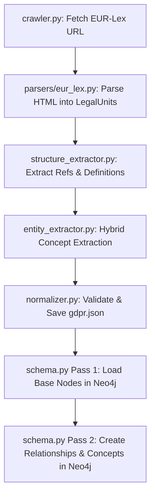
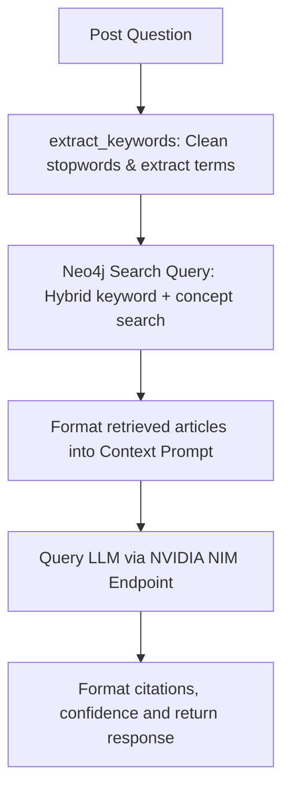

# Project Standing & Context: Legal Knowledge Graph RAG

This document outlines the current state, architecture, directory structure, file roles, and workflows of the **Legal Knowledge Graph RAG** backend system.

---

## 1. Project Overview

The backend is a **FastAPI** application designed to answer legal and regulatory questions (specifically focused on the General Data Protection Regulation - **GDPR**) using a hybrid Graph + Vector RAG approach. 
- **Graph Database**: Neo4j (storing Laws, Chapters, Articles, Recitals, Definitions, and Concepts).
- **Vector Database**: Qdrant (integrated in docker-compose, but not yet utilized in the primary `ask` flow).
- **LLM Provider**: NVIDIA NIM API Endpoint (`https://integrate.api.nvidia.com/v1`) using the `openai/gpt-oss-120b` reasoning model.

---

## 2. Directory and File Structure

```text
backend/
├── .env                  # Local configuration (API keys, ports, DB credentials)
├── .env.example          # Template configuration file
├── docker-compose.yml    # Runs Neo4j and Qdrant services
├── pyproject.toml        # Poetry/Project dependency and build configs
├── requirements.txt      # Python package requirements
├── app/
│   ├── __init__.py
│   ├── main.py           # FastAPI entrypoint; mounts CORS and routers
│   ├── api/              # API Endpoint Routers
│   │   ├── __init__.py
│   │   ├── ask.py        # Core RAG endpoint (Retrieval + LLM Answer Generation)
│   │   ├── documents.py  # Serves lists of ingested laws and their parsed contents
│   │   ├── graph.py      # Serves Neo4j nodes and edges for frontend visualization
│   │   ├── health.py     # API health check endpoint
│   │   └── laws.py       # Metadata catalog of active and coming-soon laws
│   ├── core/             # Application configuration & logging utilities
│   │   ├── __init__.py
│   │   ├── config.py     # Pydantic-based settings loader from env variables
│   │   └── logging.py    # Custom logger setup
│   ├── extraction/       # Stage-based parsing and enrichment scripts
│   │   ├── __init__.py
│   │   ├── entity_extractor.py     # Extracts key concepts (hybrid regex + LLM)
│   │   └── structure_extractor.py  # Extracts definitions and cross-references
│   ├── graph/            # Neo4j Client and Database schema operations
│   │   ├── __init__.py
│   │   ├── client.py     # Singleton Neo4j client connection and query runner
│   │   └── schema.py     # Node/Edge creation and graph integrity validation
│   ├── ingestion/        # Ingestion pipeline scripts
│   │   ├── __init__.py
│   │   ├── run.py        # Ingestion entrypoint CLI coordinating all stages
│   │   ├── normalizer.py # Validates Pydantic schemas and saves normalized JSONs
│   │   ├── crawler/
│   │   │   └── crawler.py  # Crawls and caches raw EUR-Lex HTML files
│   │   └── parsers/
│   │       └── eur_lex.py  # Parses raw HTML into Pydantic LegalUnit structures
│   └── models/           # Data validation models
│       ├── __init__.py
│       └── legal_unit.py # Pydantic definitions for LegalUnit and DefinitionModel
└── tests/                # Test suites grouped by backend layers
    ├── api/
    ├── extraction/
    └── ingestion/
```

---

## 3. Detailed File Roles

### App Core & Setup
- [app/main.py](file:///C:/Users/Ravinarayana%20U/all_projects/legaldata_graphRag/backend/app/main.py): Sets up the FastAPI app instance, adds CORS middleware (`allow_origins=["*"]`), and registers the versioned routers `/api/v1/health`, `/api/v1/ask`, `/api/v1/graph`, and `/api/v1/documents`.
- [app/core/config.py](file:///C:/Users/Ravinarayana%20U/all_projects/legaldata_graphRag/backend/app/core/config.py): Validates configurations using Pydantic. Maps `BASE_URL` or `OPENAI_BASE_URL` to point to the LLM API, and exposes directories like `DATA_DIR` dynamically.
- [app/core/logging.py](file:///C:/Users/Ravinarayana%20U/all_projects/legaldata_graphRag/backend/app/core/logging.py): Configures standard stdout logging under the logger name `legal_graph_rag`.

### Database Clients & Schema
- [app/graph/client.py](file:///C:/Users/Ravinarayana%20U/all_projects/legaldata_graphRag/backend/app/graph/client.py): Controls the connection pool to the Neo4j database using a singleton instance (`neo4j_client`). Handles constraints setup (`CREATE CONSTRAINT ... IF NOT EXISTS`) for nodes: `Law`, `Chapter`, `Article`, `Recital`, `Definition`, `Concept`.
- [app/graph/schema.py](file:///C:/Users/Ravinarayana%20U/all_projects/legaldata_graphRag/backend/app/graph/schema.py): Populates the graph. Loads nodes in Pass 1 (`load_legal_unit_to_graph`) and links relations (`REFERENCES`, `HAS_CONCEPT`) in Pass 2 (`load_references_and_concepts`). Includes integrity checkers to detect orphan and dangling stub nodes.

### Ingestion & Parsers
- [app/ingestion/run.py](file:///C:/Users/Ravinarayana%20U/all_projects/legaldata_graphRag/backend/app/ingestion/run.py): CLI interface to run the GDPR ingestion. Orchestrates crawling, parsing, enriching (structure + concepts), saving to JSON, and loading to Neo4j.
- [app/ingestion/crawler/crawler.py](file:///C:/Users/Ravinarayana%20U/all_projects/legaldata_graphRag/backend/app/ingestion/crawler/crawler.py): Downloads the raw GDPR text from EUR-Lex and saves it locally in `../data/raw` to prevent unnecessary network requests.
- [app/ingestion/parsers/eur_lex.py](file:///C:/Users/Ravinarayana%20U/all_projects/legaldata_graphRag/backend/app/ingestion/parsers/eur_lex.py): Parses EUR-Lex document structures using `BeautifulSoup`, breaking text down into individual Recitals and Articles.
- [app/ingestion/normalizer.py](file:///C:/Users/Ravinarayana%20U/all_projects/legaldata_graphRag/backend/app/ingestion/normalizer.py): Saves/loads the fully structured list of `LegalUnit` objects to `../data/normalized/gdpr.json`.

### Extractors & Enrichment
- [app/extraction/structure_extractor.py](file:///C:/Users/Ravinarayana%20U/all_projects/legaldata_graphRag/backend/app/extraction/structure_extractor.py): Runs deterministic regexes on text to discover article-to-article cross-references (e.g. `gdpr:art6` -> `gdpr:art9`) and extracts definitions from GDPR Article 4 (using patterns matching single quotes and `'means'`).
- [app/extraction/entity_extractor.py](file:///C:/Users/Ravinarayana%20U/all_projects/legaldata_graphRag/backend/app/extraction/entity_extractor.py): Extracts key concepts from articles using a hybrid approach. It first runs fast regex searches for predefined core concepts (e.g., `Consent`, `Controller`, `Processor`), then queries the LLM for custom nuanced concepts, caching them in `../data/concept_cache.json` to prevent duplicate API costs.

### API Endpoints
- [app/api/ask.py](file:///C:/Users/Ravinarayana%20U/all_projects/legaldata_graphRag/backend/app/api/ask.py): Main endpoint router for user search questions. Runs keyword matching over Neo4j, retrieves legal contexts, formats them into a prompt, and queries the LLM to generate cited legal responses.
- [app/api/graph.py](file:///C:/Users/Ravinarayana%20U/all_projects/legaldata_graphRag/backend/app/api/graph.py): Extracts subgraphs (up to limits) containing nodes and relationships to power the interactive visual graph in the UI.
- [app/api/documents.py](file:///C:/Users/Ravinarayana%20U/all_projects/legaldata_graphRag/backend/app/api/documents.py): Exposes file listings of normalized JSON laws to fetch static articles.
- [app/api/laws.py](file:///C:/Users/Ravinarayana%20U/all_projects/legaldata_graphRag/backend/app/api/laws.py): Returns metadata containing statuses of active/supported laws.

---

## 4. Current Workflows

### 4.1 Ingestion Pipeline Flow


### 4.2 Query-Execution Flow (Ask Endpoint)


---

## 5. Current Standing & Diagnostics

### 5.1 Database Statistics
The Neo4j database has been successfully populated with GDPR legal text and entities. Here is the active node count breakdown:
- **Law**: 1
- **Chapter**: 12
- **Article**: 108
- **Recital**: 173
- **Definition**: 24
- **Concept**: 25
- **Mock / Other Nodes** (Movies, Characters, Powers, etc.): ~205 nodes

### 5.2 Current Issues & Friction Points
1. **High Query Latency**: The LLM model (`openai/gpt-oss-120b`) is a large reasoning model. For complex context prompts, it runs extensive chain-of-thought (reasoning) steps. This causes single requests to take **24-27 seconds** to complete, resulting in user timeouts or the appearance of a hanging application.
2. **Neo4j Cypher Deprecation Warnings**: The `ask.py` endpoint runs a query using `CALL { ... }` without a variable scope clause. This triggers warning messages on Neo4j 5+ console logs (`warn: feature deprecated. CALL subquery without a variable scope clause is deprecated. Use CALL () { ... }`).
3. **No Query Log Visibility**: There are no logs capturing the generated Cypher queries or user prompt templates, preventing developers from tracing search matches or inspecting retrieval relevance.
4. **Brittle Answer Formatting**: If the LLM returns a `None` content object due to safety flags, API rate limits, or context cuts, the code throws an unhandled `AttributeError` on `.strip()`, responding with a generic 500 error instead of a graceful fallback.

---

## 6. Immediate Plan of Action

1. **Optimize Neo4j Queries**:
   - Rewrite `CALL { ... }` to `CALL () { ... }` in `ask.py` to silence deprecation warnings.
   - Refactor queries to target specific labels directly (e.g. `MATCH (n:Article)`) instead of doing full scans on all nodes `(n)`.
2. **Implement Logging**:
   - Log the exact Cypher query being run.
   - Log parameters (keywords) passed to the query.
   - Log LLM API inputs (prompt structure) and output reasoning context.
3. **Add Safe Response Parsing**:
   - Protect answer generation from `None` values (checking if `content` is present before doing `.strip()`).
   - Log reasoning steps if returned by the NVIDIA model for better diagnostics.
